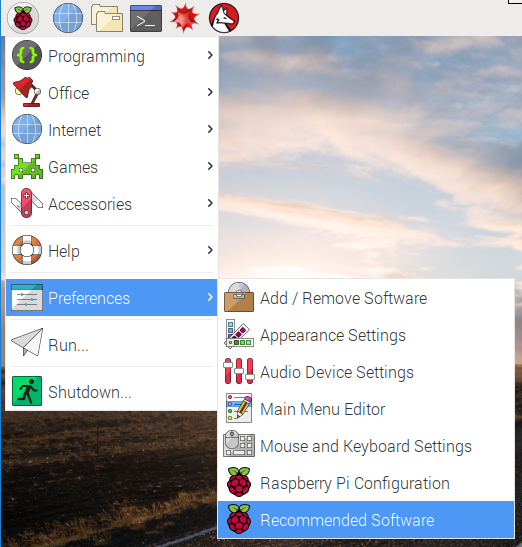
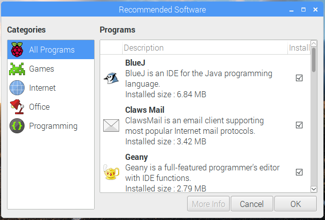
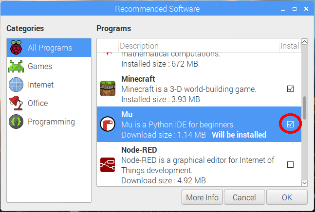

**Note:** your Pi has to be [connected to the internet](https://projects.raspberrypi.org/en/projects/raspberry-pi-using/4) before you can install software.

+ Click **Preferences** and then **Recommended Software**.

You can browse all the recommended software or filter by category.

+ Select an application to install by selecting the check box.

+ Click **OK** to install your selected application.

